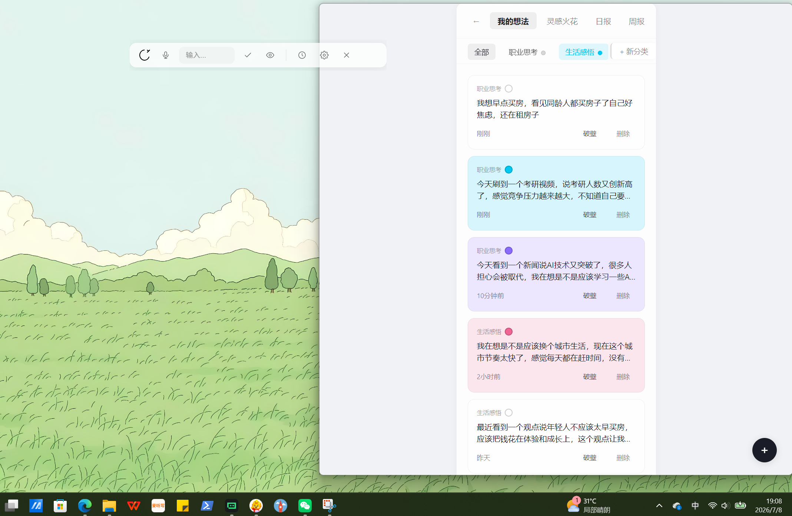
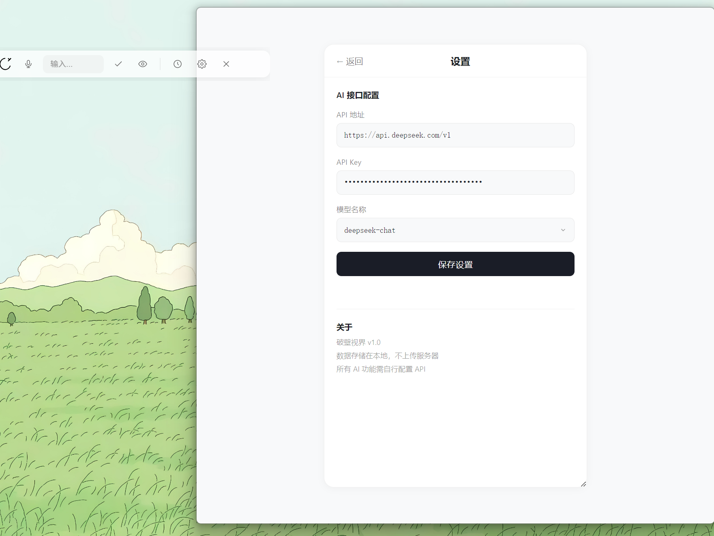
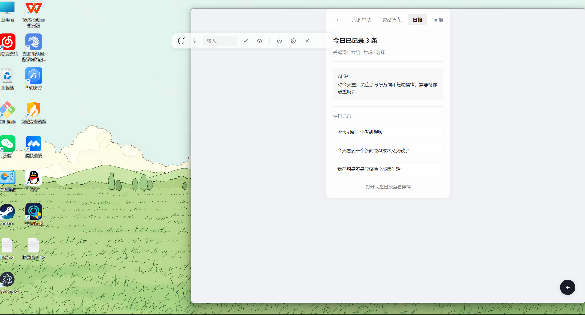
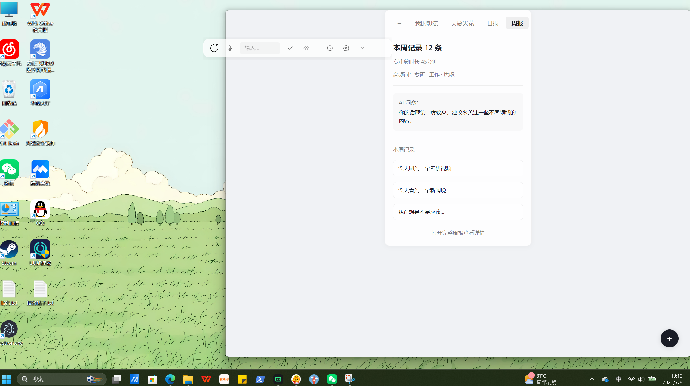
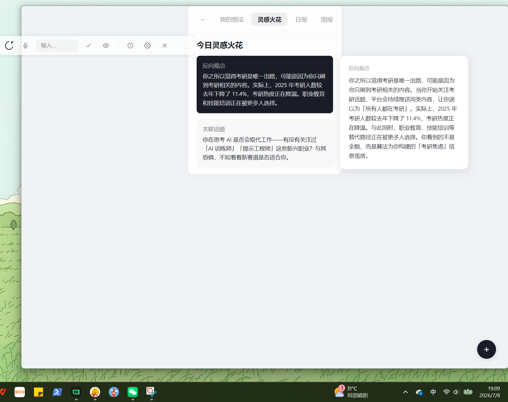

# 破壁视界

> 打破信息茧房，拥抱多元视角

一款基于 Electron 的轻量桌面悬浮工具，以悬浮窗形式常驻桌面，随时记录灵感，并由 AI 从多角度帮你"破壁"——跳出思维定式，看到更多可能性。

## ✨ 这是什么？

「破壁视界」解决一个问题：**当我们记录下一条想法时，往往只能看到自己惯常的视角。**

本工具提供一个常驻桌面顶部的悬浮条，随时记录灵感；并对每条灵感调用 AI 进行「破壁分析」——AI 会扮演一个温暖的思维伙伴，从不同角度切入，帮你发现盲点、打破思维局限，给出可执行的建议。

> 「破壁」一词源自《三体》——指打破人类自以为看透真相的执念。这里借喻打破信息茧房与思维定式。

## 📸 功能展示

| 悬浮窗 + 记录面板 | 悬浮窗 + 设置页 |
| :---: | :---: |
|  |  |

| 悬浮窗 + 日报 | 悬浮窗 + 周报 |
| :---: | :---: |
|  |  |

| 悬浮窗 + 灵感火花 | |
| :---: | :---: |
|  | |

**特色亮点**：
- 🎨 简约圆润的设计风格，支持亮色/暗色主题
- 📝 分类管理灵感（职业思考、生活感悟、人际关系等）
- 📊 智能日报/周报统计，AI 帮你总结
- ⚙️ 灵活的 AI 接口配置，支持 DeepSeek / OpenAI 兼容端点
- ✨ 灵感火花随机回顾，发现想法间的隐藏关联

## 🎯 核心功能

- 🪟 **悬浮窗** — 常驻桌面顶部，`Alt+Space` 一键呼出/隐藏，位置自动记忆
- 📝 **灵感记录** — 快速记录想法，支持分类管理
- 🧠 **破壁分析** — AI 从多角度切入，帮你打破思维局限（核心功能）
- 🎙️ **语音输入** — 支持两种方式：Whisper 兼容 API（在线）/ Windows 系统语音识别（本地离线）
- 🌓 **暗色模式** — 亮色 / 暗色主题切换
- 📊 **每日 / 每周回顾** — 自动统计记录数据并生成日报、周报
- ✨ **灵感火花** — 随机回顾历史灵感，避免尘封

## 🚀 快速开始

### 方式一：直接使用（推荐普通用户）

1. 前往 [Releases 页面](https://github.com/FishHighWJ/PoBi/releases) 下载最新版 `破壁视界-发布版.zip`
2. 解压后双击 `破壁视界.exe` 运行
3. 首次运行后，右键托盘图标 → 显示悬浮窗
4. 打开「设置页」配置你的 AI API Key（见下方 [配置说明](#%EF%B8%8F-配置说明)）

### 方式二：网页 Demo（免安装体验）

直接在浏览器中打开 `demo/demo.html` 即可体验基础功能（不含语音、本地存储等桌面端能力）。

### 方式三：开发运行

```bash
cd src
npm install
npm start
```

## ⚙️ 配置说明

应用的所有 AI 功能需自行配置 API。打开应用后进入「设置页」：

### AI 接口配置（用于破壁分析）

| 配置项 | 说明 | 示例 |
| :--- | :--- | :--- |
| API 地址 | OpenAI 兼容的接口地址 | `https://api.deepseek.com/v1` |
| API Key | 你的密钥（本地存储，不上传） | `sk-...` |
| 模型名称 | 选填，默认 `deepseek-chat` | `deepseek-chat` / `gpt-4o` 等 |

**已测试兼容的服务**：DeepSeek、OpenAI、Claude（OpenAI 兼容端点）、硅基流动等。

### 语音识别配置（用于语音输入，可选）

| 配置项 | 说明 |
| :--- | :--- |
| 语音识别 API | Whisper 兼容端点，如 `https://api.siliconflow.cn/v1/audio/transcriptions` |
| 语音识别 Key | 留空则复用上方的 AI Key |

> 💡 未配置语音 API 时，可使用 Windows 系统自带的本地语音识别（离线），无需联网，但识别精度依赖系统。

## 💾 数据存储说明

| 数据类型 | 存储位置 | 说明 |
| :--- | :--- | :--- |
| 灵感记录 | 应用 localStorage | 仅本机，不上传任何服务器 |
| 窗口位置等配置 | `系统 userData 目录/window-config.json` | 跟随用户配置 |
| 语音录音文件 | `系统 userData 目录/voice_records/` | 避免 localStorage 配额溢出 |

- **隐私**：所有数据存储在本地，AI 仅在你主动触发破壁分析时收到对应文本
- **备份迁移**：在「设置页」点击「导出全部数据」生成 JSON 备份
- **换电脑**：导出 JSON → 新机器导入即可（语音文件需手动迁移 `voice_records` 目录）

> Windows 下 `userData` 通常位于：`C:\Users\<用户名>\AppData\Roaming\破壁视界\`

## 🖥️ 系统要求

| 项目 | 要求 |
| :--- | :--- |
| 操作系统 | **仅支持 Windows 10 / 11** |
| 本地语音识别 | 需系统含 `System.Speech`（Win10/11 默认提供） |
| 在线功能 | 联网 + 自行配置的 API Key |
| 权限 | 麦克风权限（仅使用语音输入时） |

> Mac / Linux 暂不支持（依赖 Windows PowerShell + System.Speech 本地语音识别）。

## 📁 项目结构

```
PoBi/
├── src/                        # Electron 应用源码
│   ├── main.js                 # 主进程
│   ├── preload.js              # 预加载脚本（IPC 桥接）
│   ├── package.json            # 项目配置
│   ├── pages/                  # 页面
│   │   ├── 悬浮窗.html         # 悬浮主窗口
│   │   ├── 记录面板.html       # 灵感记录面板
│   │   ├── 设置页.html         # 设置页面
│   │   ├── 计时器.html         # 计时器
│   │   ├── 破壁结果.html       # 破壁结果展示
│   │   ├── 灵感火花弹窗.html   # 灵感回顾弹窗
│   │   ├── 日报.html           # 每日报告
│   │   └── 周报.html           # 每周报告
│   └── utils/                  # 工具模块
│       ├── shared.js           # 共享工具（存储层/转义/降级等）
│       └── design-system.css   # 设计系统样式
├── demo/                       # 网页版 Demo
│   └── demo.html
├── docs/                       # 文档与截图
│   ├── screenshots/            # 功能截图
│   └── RELEASE_NOTES.md        # 发布说明
├── README.md
├── LICENSE
├── CONTRIBUTING.md
├── CHANGELOG.md
├── .gitignore
└── .gitattributes
```

## 🛠️ 技术栈

- **Electron 33** — 桌面应用框架
- **HTML / CSS / 原生 JavaScript** — 前端（无构建步骤）
- **DeepSeek / OpenAI 兼容 API** — 破壁分析
- **Whisper API / Windows System.Speech** — 语音识别

## 🎮 快捷键

| 快捷键 | 功能 |
| :--- | :--- |
| `Alt + Space` | 全局呼出 / 隐藏悬浮窗 |

## 📦 打包发布

```bash
cd src
npm install
npm run build   # 使用 electron-builder
```

打包产物默认输出到 `src/dist/`。建议将产物上传至 GitHub Releases（而非提交进 git 仓库）。

## 🤝 参与贡献

欢迎提交 Issue 反馈 Bug 或建议新功能。提 PR 前请阅读 [CONTRIBUTING.md](CONTRIBUTING.md)。

## 🗺️ 项目路线图

| 阶段 | 状态 | 说明 |
| :--- | :---: | :--- |
| v1.0 | ✅ 已发布 | 核心功能：悬浮窗、灵感记录、破壁分析、语音输入、日报/周报、灵感火花 |
| v1.1 | 🔄 开发中 | 暗色模式优化、快捷键自定义、开机自启、更多 AI 模型支持 |
| v1.2 | 📋 规划中 | 云端数据同步、标签系统、灵感搜索、导出为 Markdown |
| v2.0 | 📋 规划中 | Mac / Linux 跨平台支持、插件系统、数据可视化看板 |

## 📄 License

[MIT License](LICENSE) © FishHighWJ
